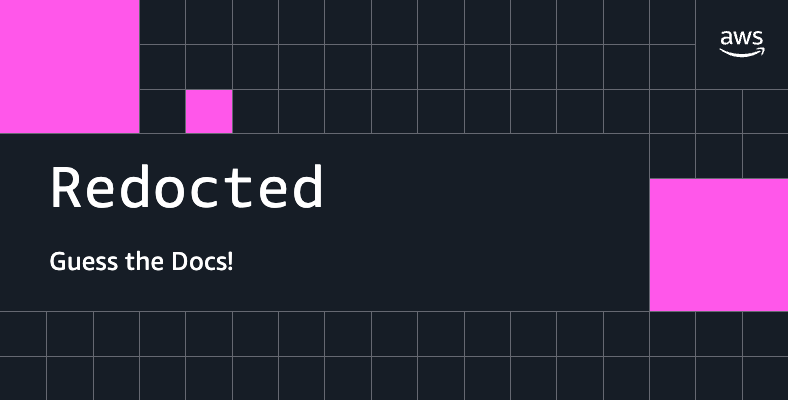
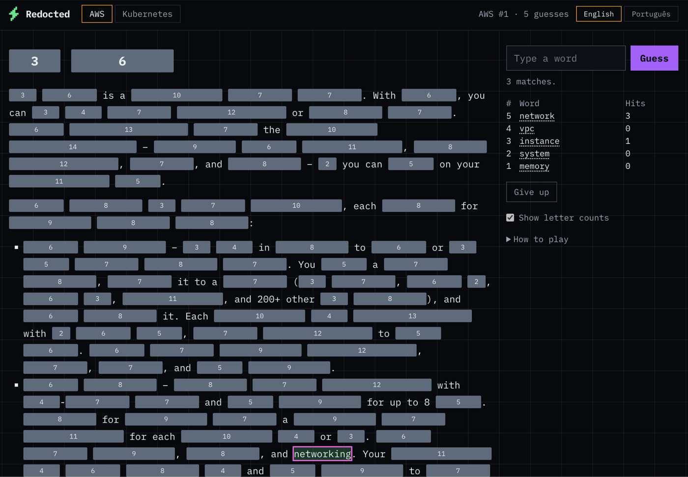
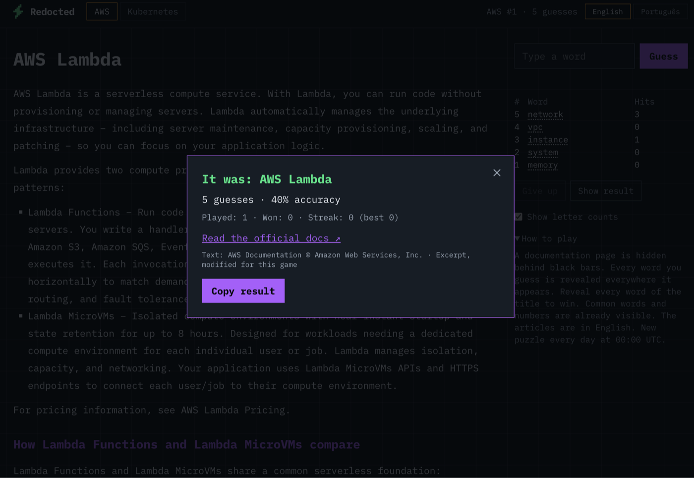

# Redocted



[](https://github.com/jhermesn/redocted/actions/workflows/ci.yml)
[](LICENSE)

A daily guessing game played on a page of the AWS or Kubernetes documentation
with most of its words blacked out. Guess words to reveal them; reveal every
word of the title to win. Inspired by [Redactle](https://redactle.net), which
does the same with Wikipedia.

**Play:** https://jhermesn.dev/redocted/ · [Português](https://jhermesn.dev/redocted/pt-br/)





## How to play

- Every word you guess is revealed everywhere it appears in the article.
- Common words (`the`, `is`, `of`...) and numbers are visible from the start.
- Word forms do not matter: `policy` reveals `policies`, `run` reveals
  `running` and `ran`. Look-alikes stay apart: `plan` does not reveal `plane`.
- Service names like `S3` or `EC2` count as one word, and so do contractions
  like `don't`.
- Tap a black bar to see how many letters it hides, or turn on "Show letter
  counts" to see them all. Screen readers announce each hidden word's length.
- Stuck? **Hint** reveals one word of the text at a time, the one with the
  most matches first. Hints never reveal a title word and never count as
  guesses.
- When you solve or give up, the whole article is revealed: close the result to
  read it, with a link to the official page.
- Fewer guesses is better. The game also tracks accuracy (the share of guesses
  that revealed at least one word) and the hints you used.
- A new puzzle comes out every day at 00:00 UTC, the same for everyone. Two
  boards: **AWS** and **Kubernetes**. Earlier puzzles stay playable.

Articles are always in English. The interface is in English and Portuguese.

## How the daily article is chosen

There is no server. The site works out today's article from the date alone:

```
puzzle   = days since 2026-10-01 (UTC) + 1
season   = the latest season that has started by that puzzle
article  = season.ids[(puzzle - season start) % number of pages]
```

Each season stores its play order, shuffled once when the corpus is built.
Everyone gets the same article on the same day, and no article repeats until
the whole season has been played. New pages start a new season in the future
that first plays the articles the current cycle has not reached yet, then the
new ones. Puzzles that are already out never change: CI and every deploy
reject changes to a season that has started or to its articles.

## Run it locally

Requires Node.js 24 or later.

```bash
npm install
npm run dev        # http://localhost:4321/redocted/
npm test           # unit tests
npm run typecheck
npm run build      # static site in dist/
```

## Where the articles come from

Nobody picks pages by hand. `npm run corpus` reads the documentation sitemaps:

- **AWS:** every English user or developer guide in
  `docs.aws.amazon.com/sitemap_index.xml`, following each guide's redirect to
  its landing ("What is ...?") page, one page per product.
- **Kubernetes:** every page under `kubernetes.io/docs/concepts/` in the site's
  sitemap.

Services AWS lists as in Maintenance, Sunset or Full Shutdown on its official
[lifecycle pages](https://docs.aws.amazon.com/general/latest/gr/service-lifecycle.html)
are left out, and are dropped from future seasons when AWS retires them later.

Each page keeps its prose, headings and lists; code, tables and page furniture
are dropped. Titles come from the sites themselves: the product name AWS
publishes for each page, and the page heading on kubernetes.io. A page is only
used when it makes a fair puzzle: at least 150 words of prose, and every title
word appears in the text. The builder also stores, for each article, which
word forms share a dictionary form (WordNet, via `wink-lemmatizer`), so the
browser matches guesses without shipping a dictionary.

Articles are committed under `corpus/`, so building the site never needs
the network, and an article never changes once it is published. Once a month a
GitHub Action runs the discovery and opens (or updates) a pull request with the
new pages as the next season. If a documentation site changes its sitemap or
layout, that run fails instead of quietly finding nothing.

## Contributing

New articles, a new interface language, or a page that came out wrong: see
[CONTRIBUTING.md](CONTRIBUTING.md). Security issues go through
[SECURITY.md](SECURITY.md).

## Content and trademarks

- Articles are excerpts (at most 700 words) of the
  [AWS Documentation](https://docs.aws.amazon.com/), © Amazon Web Services,
  Inc., and of the [Kubernetes Documentation](https://kubernetes.io/docs/),
  © The Kubernetes Authors, licensed
  [CC BY 4.0](https://creativecommons.org/licenses/by/4.0/). Every article
  links to its source page.
- Not affiliated with, endorsed by, or sponsored by Amazon Web Services or the
  Cloud Native Computing Foundation. AWS is a trademark of Amazon.com, Inc. or
  its affiliates; Kubernetes is a registered trademark of The Linux Foundation.
- Font: [IBM Plex Mono](https://github.com/IBM/plex), SIL Open Font License
  1.1, self-hosted at build time through Astro's Fonts API.

## License

Code: [MIT](LICENSE).
